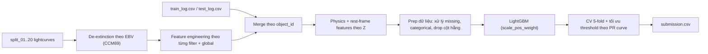

# MALLORN Astronomical Classification Challenge (bài làm `0.6649`)

## *Public Leaderboard Score: **0.6649***

Repository này lưu lại toàn bộ hướng giải và notebook dùng để tạo file nộp cho cuộc thi **MALLORN Astronomical Classification Challenge** (Kaggle).

---

# 1. Mô tả bài toán
Mục tiêu của bài toán là xây dựng mô hình **phân loại nhị phân** để phát hiện các **Tidal Disruption Events (TDEs)** (sự kiện sao bị xé bởi hố đen siêu nặng) từ dữ liệu **lightcurve đa băng** mô phỏng theo chuẩn quan sát của LSST (Vera C. Rubin Observatory).

## 1.1 Bộ dữ liệu
Dữ liệu gồm 2 nhóm chính:

- **Metadata / Log**: `train_log.csv`, `test_log.csv`
  - Chứa `object_id` và các thuộc tính tĩnh của vật thể: `Z` (redshift), `Z_err` (sai số redshift — chủ yếu có ở test), `EBV` (hệ số suy giảm do bụi), `split` (tên thư mục split).
  - Với train có thêm `SpecType` và `target` (nhãn nhị phân: 1 = TDE, 0 = không phải TDE).
- **Lightcurve theo từng split**: `split_01` … `split_20`
  - Mỗi split có `train_full_lightcurves.csv` và `test_full_lightcurves.csv`.
  - Mỗi dòng là một quan sát theo thời gian: `Time (MJD)`, `Flux`, `Flux_err`, `Filter` (6 băng: `u, g, r, i, z, y`).

## 1.2 Thử thách chính
- **Mất cân bằng lớp rất mạnh**: trong train có `148` TDE trên `3043` đối tượng (tỷ lệ ~`4.86%`).
- **Chuỗi thời gian thưa + không đều**: số điểm quan sát mỗi object khác nhau và khoảng cách thời gian không cố định.
- **Metric chấm điểm**: **F1-score** (phù hợp bài toán imbalanced vì cân bằng precision/recall).

---

# System Design
Pipeline được thiết kế theo hướng “biến time-series → tabular features”, sau đó dùng mô hình tree boosting:



---

# 2. Tổng quan hướng tiếp cận

1. **Đọc dữ liệu**: load `train_log.csv`, `test_log.csv` và toàn bộ lightcurve trong 20 split.
2. **Hiệu chỉnh bụi (de-extinction)**: dùng `EBV` để hiệu chỉnh `Flux`/`Flux_err` theo định luật CCM89.
3. **Feature engineering thủ công (hand-crafted)**:
   - Trích xuất thống kê/cadence/shape theo từng filter (`u..y`), sau đó “pivot” sang dạng wide.
   - Tạo thêm đặc trưng tương tác giữa các filter (màu/color, lệch thời gian peak, tỉ trọng peak…).
   - Tạo đặc trưng global khi gộp cả 6 filter.
4. **Bổ sung đặc trưng vật lý + rest-frame**:
   - Tính xấp xỉ luminosity distance theo `Z`.
   - Quy đổi/chuẩn hoá các đại lượng thời gian về rest-frame (chia cho `1+Z`).
   - Đặc trưng liên quan đến độ sáng tại peak theo `DL^2`.
5. **Huấn luyện LightGBM**:
   - 5-fold **StratifiedKFold**.
   - **Early stopping** và **tối ưu threshold** theo PR-curve để maximize F1.
6. **Xuất `submission.csv`**.

---

# 3. Kỹ thuật Machine Learning
## 3.1 Feature set sử dụng
- **Từ lightcurve**: `812` đặc trưng/object (không tính `object_id`). Tổng số cột của bảng feature lightcurve là `813` (có `object_id`).
- **Sau khi ghép metadata + physics/rest-frame + xử lý trong `prep_X`**: ma trận huấn luyện cuối có kích thước `X.shape = (3043, 1006)` (tức **1006 features** sau khi drop các cột hằng và xử lý missing).
- **Cột dạng categorical**: `split`, `first_filter`, `peak_filter`.

## 3.2 Mô hình cuối (LightGBM)
Sử dụng `lightgbm.LGBMClassifier` với cấu hình chính (từ notebook):

- `n_estimators=6500`, `learning_rate=0.02`
- `num_leaves=127`, `max_depth=-1`
- `subsample=0.8`, `subsample_freq=1`
- `colsample_bytree=0.75`, `feature_fraction_bynode=0.8`
- `min_child_samples=20`, `min_split_gain=0.01`
- `reg_alpha=0.4`, `reg_lambda=6.0`
- `extra_trees=True`, `force_col_wise=True`, `objective='binary'`, `n_jobs=-1`
- **Imbalance handling**: `scale_pos_weight = neg/pos = 2895/148 ≈ 19.56`

## 3.3 Validation + tối ưu threshold
- **Validation**: 5-fold `StratifiedKFold(shuffle=True, random_state=42)`.
- **Early stopping**: `early_stopping_rounds=300`, metric theo dõi `binary_logloss` trên validation fold.
- **Tối ưu ngưỡng phân lớp**:
  - Không dùng mặc định `0.5`.
  - Dùng `precision_recall_curve` để quét các `threshold` và chọn ngưỡng cho **F1 lớn nhất**.
  - Notebook in ra F1/thr theo từng fold và F1 OOF tổng.

Kết quả OOF trên notebook:
- Fold 1: `F1=0.58333 | thr=0.2438`
- Fold 2: `F1=0.63333 | thr=0.3837`
- Fold 3: `F1=0.57576 | thr=0.2539`
- Fold 4: `F1=0.64000 | thr=0.2427`
- Fold 5: `F1=0.54545 | thr=0.3777`
- **OOF F1 = `0.57862` | threshold = `0.3590`**

---

# 4. Feature engineering
## 4.1 Hiệu chỉnh extinction theo `EBV` (CCM89)
Vì `Flux` trong dataset là **chưa hiệu chỉnh bụi**, notebook thực hiện:

- Dùng `EBV` và `R_V=3.1` để tính `A_V = EBV * R_V`.
- Dùng định luật **Cardelli, Clayton & Mathis 1989 (CCM89)** để tính `A_λ` theo bước sóng hiệu dụng của từng filter (`u..y`).
- Tạo hệ số hiệu chỉnh:
  - `corr = 10^(A_λ / 2.5)`
  - `flux_corr = Flux * corr`
  - `flux_err_corr = Flux_err * corr`

## 4.2 Tiền xử lý theo quan sát
Với từng bản ghi lightcurve sau khi hiệu chỉnh:
- `flux_asinh = asinh(flux_corr)` (giúp ổn định khi flux âm/biến thiên mạnh)
- `snr = |flux_corr| / max(flux_err_corr, 1e-6)`
- Tạo thêm biến phụ: `abs_flux`, `flux_sq`, `snr_sq`, `rel_err = |flux_err|/|flux|`, trọng số `w = 1/flux_err^2`
- Sắp xếp theo `object_id, filter, mjd` và tính `dt = diff(mjd)` để rút trích cadence/shape.

## 4.3 Nhóm đặc trưng theo từng filter (`u, g, r, i, z, y`)
Tính theo group `(object_id, filter)`:

1. **Thống kê cơ bản** (ví dụ: `n_obs`, `t_min`, `t_max`, `flux_mean/std/min/max/median`, `err_mean/std/min/max`, `snr_mean/std/min/max`, …).
2. **Phân vị (quantile) & độ trải**:
   - `flux_q01/q10/q25/q75/q90/q99`, `flux_iqr = q75 - q25`, `amp = max - min`, các tỷ lệ như `amp_to_std`.
3. **Cadence / khoảng trống quan sát**:
   - `max_gap`, `med_gap`, `dt_mean/std`, `dt_p10/p90`.
4. **Diện tích/shape theo quy tắc hình thang**:
   - `area`, `area_abs`, `area_pos`, `area_neg` (từ tích phân xấp xỉ trên trục thời gian).
5. **Center-of-mass theo thời gian**:
   - `flux_com`: trọng tâm thời gian có trọng số `abs_flux`
   - `snr_com`: trọng tâm thời gian có trọng số `snr`
6. **Tín hiệu “detectable”** (lọc `snr>=3` và `flux>0`):
   - `det_n`, `det_span`, `det_frac`, `det_span_ratio`, `det_snr_max`, `det_flux_max`, …
7. **Đặc trưng quanh peak**:
   - Tìm điểm `peak_flux` lớn nhất theo filter và ghi `peak_mjd`.
   - Tính `first_flux/last_flux` (đầu/cuối chuỗi), `peak_rel` (vị trí peak trong [t_min, t_max]).
   - Slope: `rise_slope`, `decay_slope`, `trend_slope`.
   - Width tại các ngưỡng theo % peak (ví dụ `width_20`, `width_50`, `width_80`): độ rộng thời gian mà `flux >= frac * peak_flux`.
8. **Ổn định dấu & độ “nhiễu”**:
   - `sign_changes`, `sign_change_rate`.
9. **Thống kê có trọng số sai số**:
   - `flux_wmean`, `flux_wstd`, `flux_wcv`.

## 4.4 Nhóm đặc trưng tương tác giữa các filter (màu & lệch thời gian)
Sau khi pivot feature theo filter sang dạng wide, notebook tạo thêm:
- **Color/asinh tại peak**: ví dụ `color_rz_asinh = asinh(r_peak_flux) - asinh(z_peak_flux)` (tương tự cho nhiều cặp filter).
- **Color tại điểm đầu/cuối**: `color_*_first_asinh`, `color_*_last_asinh`.
- **Chênh màu theo pha**: `color_*_delta_peak_first`, `color_*_delta_last_first`, `color_*_delta_peak_last`.
- **Time-lag giữa các peak**: `dt_peak_*` (ví dụ `dt_peak_gi`).
- **Tổng hợp peak theo filter**: `peak_flux_total`, `peak_flux_std`, `peak_flux_range`, `peak_flux_ratio_max_min`, `*_peak_frac`.
- **Categorical**:
  - `first_filter`: filter xuất hiện sớm nhất (theo thời gian)
  - `peak_filter`: filter có `peak_flux` lớn nhất

## 4.5 Nhóm đặc trưng global (gộp mọi filter)
Gộp toàn bộ quan sát của object (không phân filter) và tính các đặc trưng `all_*` tương tự:
- `all_n_obs`, `all_t_span`, `all_flux_mean/std/min/max/median`, `all_snr_mean/std/max`, …
- `all_max_gap`, `all_med_gap`, `all_dt_std`, `all_area*`, …
- Nhóm detectable global: `det_all_n`, `det_all_span`, `det_all_frac`, `det_all_span_ratio`, …

## 4.6 Physics + rest-frame features (theo `Z`)
Notebook thêm lớp đặc trưng vật lý để tăng “tính thiên văn” cho feature:

- `inv1pz = 1/(1+Z)` để quy đổi về rest-frame.
- Xấp xỉ **luminosity distance** `DL_Mpc(z)` theo cosmology đơn giản (`H0=70`, `Ωm=0.3`) bằng tích phân số.
- `distmod = 5*log10(DL_Mpc) + 25`, `logDL = log(1 + DL_Mpc)`.
- Quy đổi thời gian về rest-frame: mọi cột “time-like” sẽ có biến `*_rest = * * inv1pz`.
- Quy đổi slope về rest-frame: `slope_rest = slope / inv1pz`.
- Pseudo-luminosity từ peak flux: `peak_L = peak_flux * DL^2` và `peak_L_log = log(1 + |L|)`.
- Ước lượng độ sáng tuyệt đối (dạng “magnitude proxy”): `Mpeak = (23.9 - 2.5*log10(flux)) - distmod`.
- `Z_snr = Z/Z_err` (nếu có `Z_err`).
- Thêm các đặc trưng phân phối: `bowley_skew`, `tail_9010`, `peakiness`.
- Đặc trưng màu thô: `blue_red_asinh` (tổng `u,g` trừ tổng `i,z,y` theo asinh).

---

# 5. Final Solution Pipeline
1. Load `train_log.csv`, `test_log.csv` và lightcurve theo `split_01..20`.
2. Tính bảng hệ số de-extinction `corr(object_id, filter)` từ `EBV`.
3. Trích xuất feature lightcurve (812 features/object) + feature tương tác filter + feature global.
4. Merge feature với log theo `object_id`.
5. Thêm physics/rest-frame features theo `Z`.
6. Chuẩn bị `X, y, X_test` (`prep_X`): fill median cho numeric, xử lý missing category, loại cột hằng.
7. Train LightGBM 5-fold + early stopping.
8. Tối ưu threshold trên OOF bằng PR-curve, áp threshold lên `test_prob`.
9. Ghi `submission.csv` theo format `sample_submission.csv`.

---

# 6. Hướng dẫn chạy lại
## 6.1 Chạy trên Kaggle
1. Upload/Import notebook `mallorn_0.6649.ipynb`.
2. Add dataset MALLORN vào notebook (để dữ liệu nằm trong `/kaggle/input/...`).
3. Run All → tạo `submission.csv` trong output của notebook.

## 6.2 Chạy local (Windows/Linux)
1. Đảm bảo dữ liệu nằm tại `data/mallorn-astronomical-classification-challenge/` (giữ nguyên `split_01..20`).
2. Trong notebook, chỉnh `DATA_DIR` (hoặc sửa `find_data_dir()`) để trỏ đến dataset local, ví dụ:

   ```python
   DATA_DIR = "data/mallorn-astronomical-classification-challenge"
   ```

3. Cài dependency tối thiểu:

   ```bash
   pip install numpy pandas scikit-learn lightgbm
   ```

4. Run All cells.

