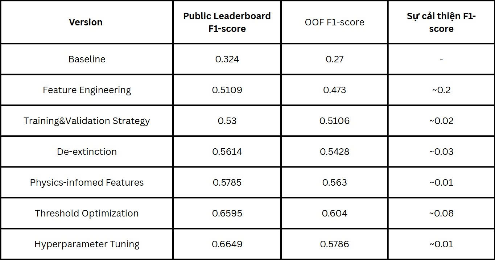

# Nhóm 20 - INT3405E 4
- Lương Anh Tuấn 23021706
- Ma Đức Minh 23020626
- Nguyễn Vũ Minh 23020629

---
# MALLORN-Astronomical-Classification-Challenge

## I. Giới thiệu
Cuộc thi MALLORN yêu cầu xây dựng mô hình khai thác dữ liệu quan sát vũ trụ trong 10 năm để phân loại sự kiện phá hủy thủy triều (TDEs) khi một ngôi sao bị xé toạc khi tiến quá gần hố đen siêu nặng

## II. Dataset
- Cột Target: 1 - TDE và 0 - Non TDE
- Format: Dữ liệu dạng bảng, nhiều dòng (tabular CSV).
- Metadata: dữ liệu mô tả object gồm 2 file test_log.csv, train_log.csv
- Lightcurve data: dữ liệu chính, object được quan sát theo thời gian gồm 20 folder split (01-20)

---
# Mô hình sử dụng: Light Gradient Boosting Machine (LightGBM)

## I. Phát hiện về Dataset

### 1) Đặc điểm dữ liệu
- Bài toán binary classification với mất cân bằng lớp nghiêm trọng với lớp TDE rất hiếm.
- Dữ liệu đầu vào gồm lightcurve đa phổ và metadata ở mức object.
- 
### 2) Đặc điểm chuỗi thời gian
- Lightcurve có cadence không đều, xuất hiện nhiều khoảng trống quan sát.
- Không thể giả định chuỗi thời gian đều hoặc liên tục.
- 
### 3) Đặc điểm tín hiệu quang học
- Flux có thể âm, phân bố lệch và có nhiễu mạnh.
- Mức độ nhiễu và biên độ tín hiệu khác nhau giữa các band.
- 
### 4) Yếu tố vật lý và quan sát
- EBV biến thiên đáng kể 
- Redshift trong tập test có sai số (Z_err)

## II. LightGBM

### 1) LightGBM là gì?
- Phiên bản nâng cấp của thuật toán Gradient Boosting nguyên bản
- Được phát triển với mục đích để tạo ra các mô hình học máy dựa trên cấu trúc cây quyết định (Decision Tree)
- Ứng dụng hai phương pháp tiếp cận độc đáo: Gradient-based One-Side Sampling (GOSS) và Exclusive Feature Bundling (EFB) nhằm tăng cường tốc độ huấn luyện và làm giảm bớt sự phức tạp trong các phép tính toán cần thiết
- 
### 2) Lí do lựa chọn
- Phù hợp dữ liệu dạng bảng
- Chịu được mất cân bằng giữa các lớp trong bài toán classification 
- Robust với nhiễu và outliers
- Không yêu cầu chuỗi thời gian đều
- Khai thác tốt feature đa phổ

## III. Phương pháp

### 1) De-extinct fluxes
Tại sao cần khử bụi?
- Flux bị ảnh hưởng bởi bụi trong thiên hà (EBV) khiến cho độ sáng quan sát bị “mờ” khác nhau giữa các object và giữa các filter
- Nếu không hiệu chỉnh thì mô hình có khả năng học sai hoặc kém tổng quát  
=> Cần <ins>chuẩn hoá flux</ins> theo extinction và theo filter để mô hình học đúng hình dạng lightcurve thay vì học bụi trong thiên hà:
  - Tính extinction A(λ) tại bước sóng λ sử dụng mô hình CCM89
  - Xây dựng bảng hệ số hiệu chỉnh extinction cho tất cả object và filter
- Tính extinction A(λ) tại bước sóng λ sử dụng mô hình CCM89
  - CCM89 là một công thức thực nghiệm mô tả cách ánh sáng từ một nguồn bị suy giảm/hấp thụ theo bước sóng khi đi qua bụi trong Milky Way: A(λ) / A_V = a + b / R_V
    - A_V: extinction tại bước sóng nhìn thấy (A_V = R_V * EBV)
    - a, b: các hàm thực nghiệm mô tả hình dạng đường cong extinction. 
    - R_V: Tỷ số extinction tiêu chuẩn
- Xây dựng bảng hệ số hiệu chỉnh extinction cho tất cả object và filter
    - Dựa vào extinction A(λ) để tính hệ số hiệu chỉnh: corr = 10 ** (A(λ) / 2.5)

### 2) Feature engineering
- Lightcurves là chuỗi thời gian không đều với các đối tượng trong dữ liệu có thời gian quan sát không đồng đều và có nhiều gaps  
=> Phải <ins>chuyển đổi chuỗi thời gian thành các đặc trưng dạng bảng</ins> để phù hợp với mô hình LightGBM:
  - Trích xuất các nhóm đặc trưng cho từng filter và toàn bộ object:
    - Đặc trưng thống kê: mean, std, min, max, median
    - Đặc trưng tần số quan sát: dt_mean, dt_gap, max_gap
    - Đặc trưng hình dạng: area, peak_flux, peak_time
    - Tính toán SNR: snr_mean
    - Đặc trưng cross-filter: color, timing differences
    - Đặc trưng liên quan đến sự thay đổi và độ nhạy của flux

### 3) Physics-informed features
- Khoảng cách và độ sáng của đối tượng có ảnh hưởng lớn đến cách chúng ta quan sát lightcurve
- Các redshift và extinction làm thay đổi độ sáng quan sát, và chỉ sử dụng flux thô có thể dẫn đến sự nhầm lẫn trong việc phân biệt TDE với non-TDE
- Bằng cách kết hợp các đặc trưng vật lý như redshift (Z) và extinction (EBV), mô hình có thể hiểu rõ hơn về độ sáng tuyệt đối và khoảng cách của các đối tượng, từ đó phân loại chính xác hơn  
=> Cần <ins>tạo ra các đặc trưng vật lý thiên văn</ins>
- Đặc trưng vật lý thiên văn:
  - Các đặc trưng từ Redshitf(Z):
    - inv1pz (đảo ngược redshift, tính luminosity distance DL​)
    - log1pZ (ổn định Z khi quá nhỏ hoặc lớn)
    - Z²
  - Độ sáng tuyệt đối
  - Các đặc trưng liên quan đến Z_err: Z_snr
  - Các đặc trưng tương tác giữa EBV và Z: EBV*Z, EBV*log1pZ
  - Các đặc trưng khác như EBV², blue_red_asinh, distmod, DL, logDL

### 4) Training & validation strategy
- Dữ liệu TDE cực kỳ hiếm và mất cân bằng nặng, nếu chia dữ liệu huấn luyện và kiểm tra 1 lần thì dễ bị overfit vào non-TDE, thiếu khả năng phân biệt TDE
  - Chuẩn bị cho model training:
    - Loại bỏ các cột không dùng cho training
    - Xử lý missing values: thay NaN bằng median
    - Xử lý categorical columns: thêm category “MISSING”
    - Loại bỏ constant columns
    - Tính scale_pos_weight cho imbalanced data
- <ins>Cross-validation</ins>:
  - Giúp mô hình đánh giá ổn định hơn
  - Giảm thiếu sự biến thiên trong các lần chia dữ liệu
- <ins>Stratified K-Fold</ins>:
  - Duy trì tỷ lệ TDE/non-TDE trong các fold giúp mô hình tránh bias bởi sự phân bố không đều 
  - Mỗi fold sử dụng 1 phần tập dữ liệu làm validation set và phần còn lại là training set
- <ins>Early stopping (rounds=300)</ins>:
  - Giúp ngừng huấn luyện không cải thiện trên tập validation
  - Giảm overfitting và tiết kiệm thời gian huấn luyện 
- <ins>scale_pos_weight</ins>:
  - Được tính toán bằng tỷ lệ giữa lớp 0 với lớp 1
  - Giúp mô hình nhạy cảm hơn với lớp hiếm TDE, giảm thiểu bias trong việc phân loại
 
### 5) Hyperparameter tuning
- LightGBM nhạy cảm với các tham số như num_leaves, learning_rate, đặc biệt với số lượng features lớn và dữ liệu nhiều noise 
- Không gian tham số cho tuning bằng Randomized Grid Search:
  - num_leaves: [63, 95, 127, 191] - Số lá
  - min_child_samples: [10, 20, 40, 80] - Số sample tối thiểu mỗi lá
  - subsample: [0.7, 0.8, 0.9] - Tỷ lệ sample data
  - colsample_bytree: [0.6, 0.75, 0.9] - Tỷ lệ features mỗi cây
  - feature_fraction_bynode: [0.6, 0.75, 0.85] - Tỷ lệ features mỗi node
  - reg_alpha: [0.0, 0.2, 0.6, 1.0] - L1 regularization
  - reg_lambda: [2.0, 6.0, 10.0] - L2 regularization
  - min_split_gain: [0.0, 0.01, 0.05] - Gain tối thiểu để split
  - max_depth: [-1, 8, 12] - Độ sâu tối đa

### 6) Threshold optimization
- Vì sao cần Threshold optimization?
  - F1-score là metric chính trong cuộc thi và phụ thuộc vào threshold phân loại (ngưỡng xác định TDE hoặc non-TDE).
  - Imbalance dữ liệu (TDE cực hiếm) khiến threshold 0.5 thường không tối ưu. Nếu dùng ngưỡng này, mô hình sẽ dễ bị bias về lớp phổ biến (non-TDE).
  - Tối ưu ngưỡng phân loại giúp cân bằng precision và recall, từ đó tối đa hóa F1-score, làm mô hình phân biệt TDE chính xác hơn.
- Triển khai:
  - Tính Precision-Recall curve cho từ OOF probabilities
  - Tính F1-score tại các threshold khác nhau và chọn ra ngưỡng cho F1 cao nhất
     - F1 = 2 * (Precision * Recall) / (Precision + Recall)

## IV. Kết quả

